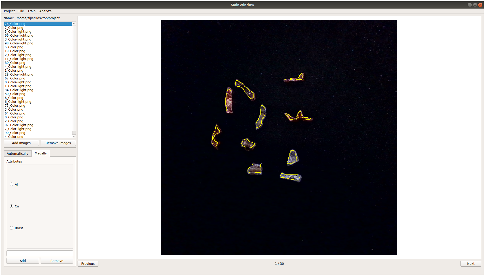

# HSG-GUI for Image Labeling, Model Training and Result Analyzing

This is a GUI application made for HSG Company based on [Mask R-CNN](https://arxiv.org/abs/1703.06870). HSG-GUI involves functions of labeling, training, and analyzing. This application is specially designed for users who are not familiar with deep learning so that they can label, train, and analyze models in one place.

# Requirements

   - PyQt5
   - Python >= 3.7

# Getting Started

    python3 welcome_scene_controller.py

# Step by Step Demo
<https://drive.google.com/file/d/1eEXOiapK6qZvadZfkDaCgbwtgl0rOOqs/view?usp=sharing>